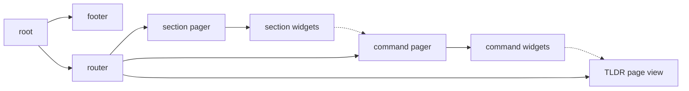

# Contributing to cheatsheet

cheatsheet is *made* for contributions.

It's easy to get started and there are many ways to help cheatsheet grow into a
useful tool. You can:

* Add new [commands](#commands) to the dataset!
* Add your OS or distro to the dataset [filters](#filters)!
* Open [issues][issues] to fix bugs and enhance cheatsheet!
* Work on the [TUI frontend](#tui-frontend) written in Go with [tview][tview]!

[issues]: https://github.com/atlasamerican/cheatsheet/issues

Please familiarize yourself with the general [contribution process][contrib] and
see [#1][issue-1] for help.

[issue-1]: https://github.com/atlasamerican/cheatsheet/issues/1
[contrib]:
  https://docs.github.com/en/get-started/quickstart/contributing-to-projects


## Commands

cheatsheet's dataset uses the [YAML][yaml] format and is simple to expand.
Its main form of data is metadata about [TLDR][tldr] pages, which refers to a
page by its name and uses some additional keys to categorize and describe the
associated command.

[yaml]: https://learnxinyminutes.com/docs/yaml/
[tldr]: https://tldr.sh/

For example:

```yaml
name: dnf
description: Update the system
example: dnf upgrade
section: Package management
filters: [rpm]
```

This data file links to the `dnf` TLDR page. It is part of the `Package
management` section, has a description of the command's effect along with the
usage to obtain that effect. The filter means it will only be shown to users
where it's relevant: on systems using rpm package management.

It would exist in the [dataset](data) as the file `dnf.yml`.

It's also possible to define multiple commands in the same file with a global
section. This looks like:

```yaml
section: Package management

commands:
    - name: dnf
      description: Update the system
      example: dnf upgrade
      filters: [rpm]
    - name: pacman
      description: Update the system
      example: pacman -Syu
      filters: [pacman]
```

It would be named `package-management.yml`.

### Contributing!

Add new commands!

Please review the YAML schema [here](https://github.com/atlasamerican/cheatsheet/wiki/Data-schema#multiple-commands).

If a file exists for the section of your command, please add it to this file.
Otherwise, create a new file for your command or commands.

The easiest way to do this is directly on GitHub by
[adding a new file][add-data] to the dataset!
Check out GitHub's [documentation][filter-docs] about this feature if you'd like to learn more.

[add-data]: https://github.com/atlasamerican/cheatsheet/new/main/data
[filter-docs]: https://docs.github.com/en/repositories/working-with-files/managing-files/editing-files#editing-files-in-another-users-repository

Check out this [issue](https://github.com/atlasamerican/cheatsheet/issues/1) if you need help!

## Filters

The [dataset filters](data/__filters__.yml) used above are defined in a special
file: `__filters__.yml`.

Its format is simple:

```yaml
rpm:
    os: linux
    distros: [fedora, almalinux]

pacman:
    os: linux
    distros: [arch]
```

* Top-level keys define filters by name.
* The `os` key is the name of an operating system.
* The `distros` key contains an array of Linux distro names.

Commands are filtered first based on OS, then using the specified distro names
when on Linux.

### Contributing!

Add applicable filters or expand filters' distros.
If you're adding a command, feel free to also add any appropriate filters.

* `os` value must be one that Go can detect at runtime. See [this list][os-list] of possible values.
* `distros` value should contain strings as given in the ID= field of the /etc/os-release file shipped by your distro.

Please review the YAML schema [here](https://github.com/atlasamerican/cheatsheet/wiki/Data-schema#filters).

[os-list]: https://gist.github.com/asukakenji/f15ba7e588ac42795f421b48b8aede63#goos-values

The easiest way to do this is directly on GitHub by
[editing `__filters__.yml`][edit-filters]!
Check out GitHub's [documentation][filter-docs] about this feature if you'd like to learn more.

[edit-filters]: https://github.com/atlasamerican/cheatsheet/edit/main/data/__filters__.yml
[filter-docs]: https://docs.github.com/en/repositories/working-with-files/managing-files/editing-files#editing-files-in-another-users-repository

Check out this [issue](https://github.com/atlasamerican/cheatsheet/issues/1) if you need help!

## TUI frontend

The UI is implemented in Go with the [tview][tview] package.

[tview]: https://github.com/rivo/tview

The UI is generally structured as follows:



* The router displays a single pager or page view.
* A pager lists widgets built from dataset commands or sections.
* The TLDR page view renders the TLDR page in cheatsheet.
* The footer shows key hints, the page number, and error messages.

Reading existing code is the best way to understand the
approach to building the UI.
The [tview wiki](https://github.com/rivo/tview/wiki) is also an invaluable resource.

### Contributing!

If you know Go, check out the [frontend issues][frontend-issues]:
* Help fix any open issues!
* Work on an enhancement!

[frontend-issues]: https://github.com/atlasamerican/cheatsheet/issues?q=is%3Aissue+is%3Aopen+label%3Afrontend
